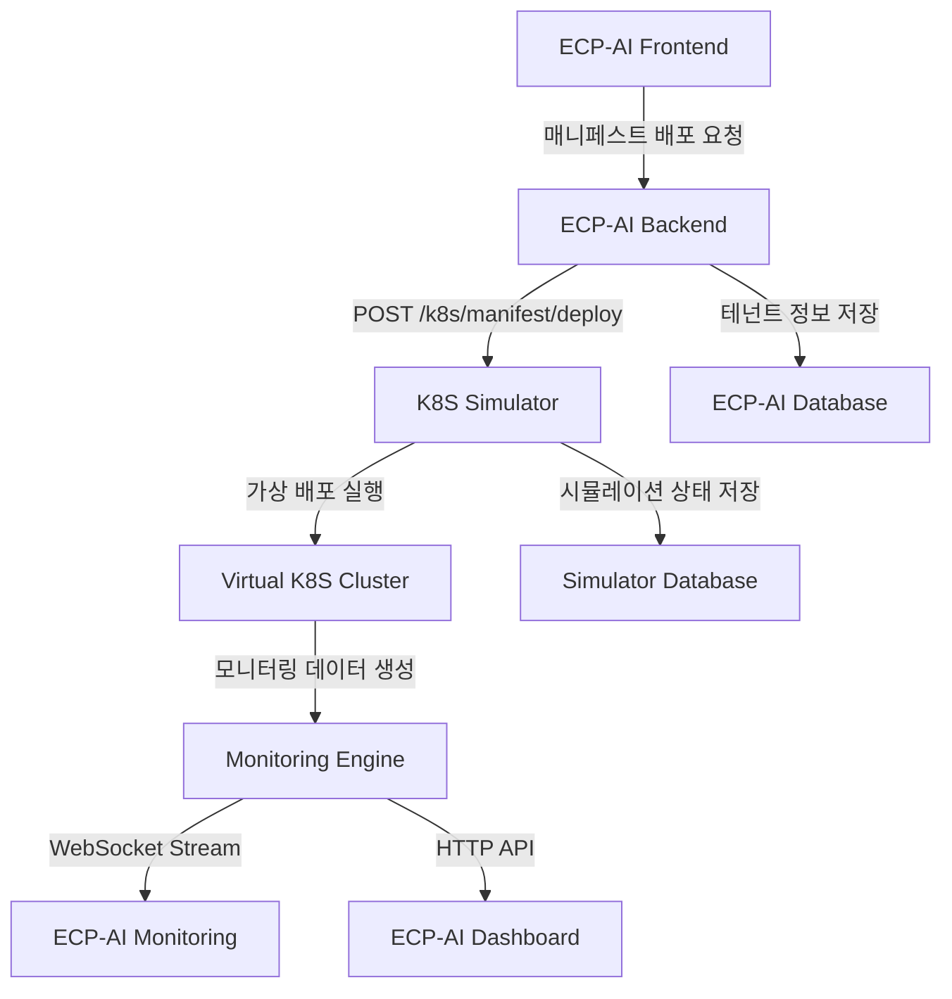

# 🤖 K8S Simulator 연동 가이드
## ECP-AI Kubernetes Orchestrator ↔ AI 시뮬레이터 연동

---

## 📋 목차
1. [시스템 개요](#시스템-개요)
2. [연동 아키텍처](#연동-아키텍처)
3. [API 엔드포인트](#api-엔드포인트)
4. [매니페스트 배포 연동](#매니페스트-배포-연동)
5. [실시간 모니터링 연동](#실시간-모니터링-연동)
6. [데이터베이스 연동](#데이터베이스-연동)
7. [구현 예제](#구현-예제)
8. [트러블슈팅](#트러블슈팅)

---

## 시스템 개요

### 🎯 K8S Simulator 역할
- **매니페스트 파싱**: ECP-AI에서 생성한 YAML 매니페스트 수신 및 분석
- **가상 배포**: 실제 K8s 클러스터 없이 배포 프로세스 시뮬레이션
- **모니터링 데이터 생성**: 실제 서버 환경과 유사한 메트릭 데이터 제공
- **SLA 99.5% 달성**: 장애 시나리오 포함한 현실적인 운영 환경 모사

### 🏗️ 현재 동작 중인 서비스
```
✅ K8S Simulator API     - http://localhost:6360
✅ Monitoring Engine     - http://localhost:6381  
✅ PostgreSQL Database   - localhost:6350
✅ Redis Cache          - localhost:6351
✅ WebSocket Monitoring - ws://localhost:6360/ws/monitoring
```

---

## 연동 아키텍처

### 🔄 데이터 플로우


### 🌐 네트워크 연결
```
ECP-AI Backend (포트 8001) ←→ K8S Simulator (포트 6360)
ECP-AI Database (포트 5433/5434) ←→ Simulator Database (포트 6350)
ECP-AI Frontend (포트 3000) ←→ Simulator WebSocket (포트 6360)
```

---

## API 엔드포인트

### 🚀 매니페스트 배포 API

#### 1. 매니페스트 파싱
```http
POST http://localhost:6360/k8s/manifest/parse
Content-Type: application/json

{
  "manifest": "apiVersion: v1\nkind: Namespace\nmetadata:\n  name: ecp-ai-tenant-123",
  "tenant_id": "tenant-123",
  "deployment_mode": "demo"
}
```

**응답:**
```json
{
  "status": "success",
  "resources": [
    {
      "apiVersion": "v1",
      "kind": "Namespace",
      "metadata": {
        "name": "ecp-ai-tenant-123"
      }
    }
  ],
  "count": 1,
  "tenant_id": "tenant-123"
}
```

#### 2. 매니페스트 배포
```http
POST http://localhost:6360/k8s/manifest/deploy
Content-Type: application/json

{
  "manifest": "apiVersion: v1\nkind: Pod\nmetadata:\n  name: callbot-pod",
  "tenant_id": "tenant-123",
  "deployment_mode": "demo"
}
```

**응답:**
```json
{
  "status": "completed",
  "deployed_count": 3,
  "failed_count": 0,
  "tenant_id": "tenant-123",
  "resources": [
    {
      "id": "default/Pod/callbot-pod",
      "name": "callbot-pod",
      "namespace": "default",
      "kind": "Pod",
      "status": "Running",
      "created_at": "2024-01-15T10:30:00Z",
      "deployment_time": 3.2
    }
  ]
}
```

### 📊 모니터링 API

#### 1. 실시간 모니터링 데이터
```http
GET http://localhost:6360/monitoring/health
```

**응답:**
```json
{
  "timestamp": "2024-01-15T10:30:00Z",
  "services": {
    "web-frontend": {
      "cpu": {
        "usage_percent": 45.2,
        "load_1m": 1.8
      },
      "memory": {
        "usage_mb": 512.3,
        "usage_percent": 25.1
      },
      "network": {
        "requests_per_second": 150.5,
        "response_time_ms": 120.3,
        "error_rate_percent": 0.05
      },
      "health": {
        "status": "healthy",
        "uptime_seconds": 86400
      }
    }
  },
  "summary": {
    "overall_health": "healthy",
    "sla_percentage": 99.972,
    "sla_status": "meeting",
    "total_services": 5,
    "healthy_services": 5
  }
}
```

#### 2. 특정 테넌트 모니터링
```http
GET http://localhost:6360/monitoring/tenant/{tenant_id}
```

#### 3. SLA 상태 확인
```http
GET http://localhost:6360/sla/status
```

**응답:**
```json
{
  "status": "meeting",
  "percentage": 99.972,
  "target": 99.5,
  "data_points": 60,
  "healthy_points": 60
}
```

### 🔍 리소스 관리 API

#### 1. 배포된 리소스 조회
```http
GET http://localhost:6360/k8s/resources
GET http://localhost:6360/k8s/resources?namespace=ecp-ai-tenant-123
GET http://localhost:6360/k8s/resources?kind=Pod
```

#### 2. 리소스 삭제
```http
DELETE http://localhost:6360/k8s/resources/{resource_name}?namespace=default&kind=Pod
```

---

## 매니페스트 배포 연동

### 🎯 ECP-AI Backend 연동 코드

#### 1. 시뮬레이터 클라이언트 클래스
```python
# backend/integrations/k8s_simulator_client.py
import httpx
import asyncio
import json
from typing import Dict, Any, Optional
import logging

logger = logging.getLogger(__name__)

class K8sSimulatorClient:
    """K8S 시뮬레이터 연동 클라이언트"""
    
    def __init__(self, base_url: str = "http://localhost:6360"):
        self.base_url = base_url
        self.client = httpx.AsyncClient(timeout=30.0)
    
    async def deploy_manifest(
        self, 
        manifest_content: str, 
        tenant_id: str,
        deployment_mode: str = "demo"
    ) -> Dict[str, Any]:
        """매니페스트 배포"""
        try:
            response = await self.client.post(
                f"{self.base_url}/k8s/manifest/deploy",
                json={
                    "manifest": manifest_content,
                    "tenant_id": tenant_id,
                    "deployment_mode": deployment_mode
                }
            )
            response.raise_for_status()
            return response.json()
            
        except httpx.HTTPError as e:
            logger.error(f"Simulator deployment failed: {e}")
            raise Exception(f"시뮬레이터 배포 실패: {str(e)}")
    
    async def get_deployment_status(self, tenant_id: str) -> Dict[str, Any]:
        """배포 상태 조회"""
        try:
            response = await self.client.get(
                f"{self.base_url}/k8s/resources",
                params={"tenant_id": tenant_id}
            )
            response.raise_for_status()
            return response.json()
            
        except httpx.HTTPError as e:
            logger.error(f"Status check failed: {e}")
            return {"status": "error", "message": str(e)}
    
    async def get_monitoring_data(self, tenant_id: Optional[str] = None) -> Dict[str, Any]:
        """모니터링 데이터 조회"""
        try:
            url = f"{self.base_url}/monitoring/health"
            if tenant_id:
                url = f"{self.base_url}/monitoring/tenant/{tenant_id}"
            
            response = await self.client.get(url)
            response.raise_for_status()
            return response.json()
            
        except httpx.HTTPError as e:
            logger.error(f"Monitoring data fetch failed: {e}")
            return {"status": "error", "message": str(e)}
```

#### 2. ECP-AI API 라우터 수정
```python
# backend/api/routes.py (기존 파일에 추가)
from integrations.k8s_simulator_client import K8sSimulatorClient

# 글로벌 시뮬레이터 클라이언트
simulator_client = K8sSimulatorClient()

@router.get("/tenants/{tenant_id}/manifest")
async def get_manifest(tenant_id: str, request: Request):
    """매니페스트 생성 및 시뮬레이터 배포"""
    is_demo = request.headers.get("X-Demo-Mode", "false").lower() == "true"
    
    try:
        # 기존 매니페스트 생성 로직
        manifest_content = await generate_manifest(tenant_id, is_demo)
        
        # 시뮬레이터에 배포 (데모 모드일 때만)
        if is_demo:
            deployment_result = await simulator_client.deploy_manifest(
                manifest_content=manifest_content,
                tenant_id=tenant_id,
                deployment_mode="demo"
            )
            
            # 배포 결과를 응답에 포함
            return {
                "manifest": manifest_content,
                "simulator_deployment": deployment_result
            }
        
        return {"manifest": manifest_content}
        
    except Exception as e:
        raise HTTPException(status_code=500, detail=str(e))

@router.post("/tenants/{tenant_id}/deploy-to-simulator")
async def deploy_to_simulator(tenant_id: str, request: Request):
    """시뮬레이터에 직접 배포"""
    is_demo = request.headers.get("X-Demo-Mode", "false").lower() == "true"
    
    if not is_demo:
        raise HTTPException(status_code=400, detail="시뮬레이터는 데모 모드에서만 사용 가능합니다")
    
    try:
        # 매니페스트 생성
        manifest_content = await generate_manifest(tenant_id, is_demo)
        
        # 시뮬레이터 배포
        result = await simulator_client.deploy_manifest(
            manifest_content=manifest_content,
            tenant_id=tenant_id,
            deployment_mode="demo"
        )
        
        return {
            "status": "success",
            "tenant_id": tenant_id,
            "deployment_result": result
        }
        
    except Exception as e:
        raise HTTPException(status_code=500, detail=f"배포 실패: {str(e)}")

@router.get("/tenants/{tenant_id}/simulator-status")
async def get_simulator_status(tenant_id: str):
    """시뮬레이터 배포 상태 조회"""
    try:
        status = await simulator_client.get_deployment_status(tenant_id)
        monitoring = await simulator_client.get_monitoring_data(tenant_id)
        
        return {
            "tenant_id": tenant_id,
            "deployment_status": status,
            "monitoring_data": monitoring
        }
        
    except Exception as e:
        raise HTTPException(status_code=500, detail=str(e))
```

### 🖱️ Frontend 연동 (매니페스트 배포 버튼)

#### 1. React 컴포넌트 수정
```javascript
// frontend/src/components/TenantDashboard.jsx
import React, { useState, useEffect } from 'react';

const TenantDashboard = ({ tenantId }) => {
    const [deploymentStatus, setDeploymentStatus] = useState(null);
    const [monitoringData, setMonitoringData] = useState(null);
    const [isDeploying, setIsDeploying] = useState(false);

    // 시뮬레이터 배포 함수
    const deployToSimulator = async () => {
        setIsDeploying(true);
        try {
            const response = await fetch(`/api/v1/tenants/${tenantId}/deploy-to-simulator`, {
                method: 'POST',
                headers: {
                    'Content-Type': 'application/json',
                    'X-Demo-Mode': 'true'  // 데모 모드 헤더
                }
            });

            if (!response.ok) {
                throw new Error('배포 실패');
            }

            const result = await response.json();
            setDeploymentStatus(result);
            
            // 배포 후 모니터링 시작
            startMonitoring();
            
        } catch (error) {
            console.error('시뮬레이터 배포 오류:', error);
            alert('배포에 실패했습니다: ' + error.message);
        } finally {
            setIsDeploying(false);
        }
    };

    // 모니터링 데이터 조회
    const startMonitoring = () => {
        const interval = setInterval(async () => {
            try {
                const response = await fetch(`/api/v1/tenants/${tenantId}/simulator-status`);
                const data = await response.json();
                setMonitoringData(data.monitoring_data);
            } catch (error) {
                console.error('모니터링 데이터 조회 실패:', error);
            }
        }, 5000); // 5초마다 업데이트

        return () => clearInterval(interval);
    };

    return (
        <div className="tenant-dashboard">
            <h2>테넌트: {tenantId}</h2>
            
            {/* 배포 버튼 */}
            <div className="deployment-section">
                <button 
                    onClick={deployToSimulator}
                    disabled={isDeploying}
                    className="deploy-button"
                >
                    {isDeploying ? '배포 중...' : '시뮬레이터에 배포'}
                </button>
            </div>

            {/* 배포 상태 */}
            {deploymentStatus && (
                <div className="deployment-status">
                    <h3>배포 상태</h3>
                    <p>상태: {deploymentStatus.deployment_result.status}</p>
                    <p>배포된 리소스: {deploymentStatus.deployment_result.deployed_count}개</p>
                </div>
            )}

            {/* 모니터링 데이터 */}
            {monitoringData && (
                <div className="monitoring-section">
                    <h3>실시간 모니터링</h3>
                    <div className="metrics-grid">
                        <div className="metric-card">
                            <h4>전체 상태</h4>
                            <p>{monitoringData.summary.overall_health}</p>
                        </div>
                        <div className="metric-card">
                            <h4>SLA 달성률</h4>
                            <p>{monitoringData.summary.sla_percentage}%</p>
                        </div>
                        <div className="metric-card">
                            <h4>정상 서비스</h4>
                            <p>{monitoringData.summary.healthy_services}/{monitoringData.summary.total_services}</p>
                        </div>
                    </div>
                </div>
            )}
        </div>
    );
};

export default TenantDashboard;
```

---

## 실시간 모니터링 연동

### 🔌 WebSocket 연결

#### 1. Backend WebSocket 핸들러
```python
# backend/api/websocket_routes.py
from fastapi import WebSocket, WebSocketDisconnect
import asyncio
import json
from integrations.k8s_simulator_client import K8sSimulatorClient

simulator_client = K8sSimulatorClient()

@app.websocket("/ws/monitoring/{tenant_id}")
async def websocket_monitoring_endpoint(websocket: WebSocket, tenant_id: str):
    """시뮬레이터 모니터링 데이터 실시간 스트리밍"""
    await websocket.accept()
    
    try:
        while True:
            # 시뮬레이터에서 모니터링 데이터 가져오기
            monitoring_data = await simulator_client.get_monitoring_data(tenant_id)
            
            # WebSocket으로 전송
            await websocket.send_text(json.dumps({
                "type": "monitoring_update",
                "tenant_id": tenant_id,
                "data": monitoring_data,
                "timestamp": monitoring_data.get("timestamp")
            }))
            
            await asyncio.sleep(5)  # 5초마다 업데이트
            
    except WebSocketDisconnect:
        print(f"WebSocket disconnected for tenant {tenant_id}")
    except Exception as e:
        print(f"WebSocket error: {e}")
        await websocket.close()
```

#### 2. Frontend WebSocket 연결
```javascript
// frontend/src/hooks/useSimulatorMonitoring.js
import { useState, useEffect, useRef } from 'react';

export const useSimulatorMonitoring = (tenantId) => {
    const [monitoringData, setMonitoringData] = useState(null);
    const [connectionStatus, setConnectionStatus] = useState('disconnected');
    const wsRef = useRef(null);

    useEffect(() => {
        if (!tenantId) return;

        // WebSocket 연결
        const connectWebSocket = () => {
            const wsUrl = `ws://localhost:8001/ws/monitoring/${tenantId}`;
            wsRef.current = new WebSocket(wsUrl);

            wsRef.current.onopen = () => {
                setConnectionStatus('connected');
                console.log('시뮬레이터 모니터링 WebSocket 연결됨');
            };

            wsRef.current.onmessage = (event) => {
                try {
                    const data = JSON.parse(event.data);
                    if (data.type === 'monitoring_update') {
                        setMonitoringData(data.data);
                    }
                } catch (error) {
                    console.error('WebSocket 메시지 파싱 오류:', error);
                }
            };

            wsRef.current.onclose = () => {
                setConnectionStatus('disconnected');
                console.log('WebSocket 연결 종료, 재연결 시도...');
                
                // 3초 후 재연결 시도
                setTimeout(connectWebSocket, 3000);
            };

            wsRef.current.onerror = (error) => {
                console.error('WebSocket 오류:', error);
                setConnectionStatus('error');
            };
        };

        connectWebSocket();

        // 컴포넌트 언마운트 시 연결 종료
        return () => {
            if (wsRef.current) {
                wsRef.current.close();
            }
        };
    }, [tenantId]);

    return { monitoringData, connectionStatus };
};
```

---

## 데이터베이스 연동

### 🗄️ 공유 데이터베이스 스키마

#### 1. 테넌트-시뮬레이터 매핑 테이블
```sql
-- ECP-AI Database에 추가할 테이블
CREATE TABLE simulator_deployments (
    id SERIAL PRIMARY KEY,
    tenant_id INTEGER REFERENCES tenants(id),
    simulator_deployment_id VARCHAR(255) NOT NULL,
    manifest_content TEXT NOT NULL,
    deployment_status VARCHAR(50) DEFAULT 'pending',
    deployed_resources JSONB,
    created_at TIMESTAMP WITH TIME ZONE DEFAULT CURRENT_TIMESTAMP,
    updated_at TIMESTAMP WITH TIME ZONE DEFAULT CURRENT_TIMESTAMP
);

CREATE INDEX idx_simulator_deployments_tenant ON simulator_deployments(tenant_id);
CREATE INDEX idx_simulator_deployments_status ON simulator_deployments(deployment_status);
```

#### 2. 모니터링 데이터 동기화
```python
# backend/services/simulator_sync_service.py
import asyncio
from sqlalchemy.orm import Session
from core.database import get_db, SimulatorDeployment
from integrations.k8s_simulator_client import K8sSimulatorClient

class SimulatorSyncService:
    """시뮬레이터 데이터 동기화 서비스"""
    
    def __init__(self):
        self.simulator_client = K8sSimulatorClient()
    
    async def sync_deployment_status(self):
        """배포 상태 동기화"""
        db = next(get_db())
        
        try:
            # 진행 중인 배포들 조회
            pending_deployments = db.query(SimulatorDeployment).filter(
                SimulatorDeployment.deployment_status.in_(['pending', 'deploying'])
            ).all()
            
            for deployment in pending_deployments:
                # 시뮬레이터에서 상태 조회
                status = await self.simulator_client.get_deployment_status(
                    deployment.tenant_id
                )
                
                # 상태 업데이트
                if status.get('status') == 'completed':
                    deployment.deployment_status = 'completed'
                    deployment.deployed_resources = status.get('resources', {})
                elif status.get('status') == 'failed':
                    deployment.deployment_status = 'failed'
                
            db.commit()
            
        except Exception as e:
            db.rollback()
            print(f"Sync error: {e}")
        finally:
            db.close()
    
    async def start_background_sync(self):
        """백그라운드 동기화 시작"""
        while True:
            await self.sync_deployment_status()
            await asyncio.sleep(30)  # 30초마다 동기화
```

---

## 구현 예제

### 🎯 완전한 연동 시나리오

#### 1. ECP-AI에서 매니페스트 배포 버튼 클릭
```python
# 사용자가 "데모 배포" 버튼 클릭
# → Frontend에서 API 호출
# → Backend에서 매니페스트 생성
# → 시뮬레이터에 배포 요청
# → 실시간 모니터링 시작
```

#### 2. 전체 플로우 구현
```python
# backend/services/demo_deployment_service.py
from integrations.k8s_simulator_client import K8sSimulatorClient
from core.manifest_generator import ManifestGenerator

class DemoDeploymentService:
    """데모 배포 서비스"""
    
    def __init__(self):
        self.simulator_client = K8sSimulatorClient()
        self.manifest_generator = ManifestGenerator()
    
    async def deploy_tenant_to_simulator(self, tenant_id: str, tenant_data: dict):
        """테넌트를 시뮬레이터에 배포"""
        try:
            # 1. 매니페스트 생성
            manifest_content = await self.manifest_generator.generate_manifest(
                tenant_data, is_demo=True
            )
            
            # 2. 시뮬레이터에 배포
            deployment_result = await self.simulator_client.deploy_manifest(
                manifest_content=manifest_content,
                tenant_id=tenant_id,
                deployment_mode="demo"
            )
            
            # 3. 배포 결과 저장
            await self._save_deployment_result(tenant_id, deployment_result, manifest_content)
            
            # 4. 모니터링 시작
            asyncio.create_task(self._start_monitoring(tenant_id))
            
            return {
                "status": "success",
                "deployment_id": deployment_result.get("deployment_id"),
                "deployed_resources": deployment_result.get("deployed_count", 0),
                "monitoring_url": f"ws://localhost:8001/ws/monitoring/{tenant_id}"
            }
            
        except Exception as e:
            return {
                "status": "error",
                "message": str(e)
            }
    
    async def _start_monitoring(self, tenant_id: str):
        """모니터링 시작"""
        # WebSocket 연결을 통해 실시간 데이터 스트리밍
        pass
```

---

## 트러블슈팅

### ❗ 일반적인 문제 해결

#### 1. 시뮬레이터 연결 실패
```bash
# 시뮬레이터 상태 확인
curl http://localhost:6360/
curl http://localhost:6360/monitoring/health

# 로그 확인
docker-compose logs k8s-simulator
```

#### 2. WebSocket 연결 오류
```javascript
// Frontend에서 연결 상태 확인
const checkSimulatorConnection = async () => {
    try {
        const response = await fetch('http://localhost:6360/monitoring/health');
        if (response.ok) {
            console.log('시뮬레이터 연결 정상');
        }
    } catch (error) {
        console.error('시뮬레이터 연결 실패:', error);
    }
};
```

#### 3. 매니페스트 배포 실패
```python
# 배포 실패 시 디버깅
async def debug_deployment(manifest_content: str):
    # 1. 매니페스트 검증
    parse_result = await simulator_client.parse_manifest(manifest_content)
    if parse_result.get("status") != "success":
        print(f"매니페스트 파싱 오류: {parse_result.get('message')}")
    
    # 2. 배포 재시도
    retry_count = 3
    for i in range(retry_count):
        try:
            result = await simulator_client.deploy_manifest(manifest_content)
            return result
        except Exception as e:
            print(f"배포 시도 {i+1} 실패: {e}")
            if i == retry_count - 1:
                raise e
            await asyncio.sleep(2)
```

### 🔧 성능 최적화

#### 1. 연결 풀 사용
```python
# 시뮬레이터 클라이언트 최적화
class OptimizedK8sSimulatorClient:
    def __init__(self):
        self.client = httpx.AsyncClient(
            timeout=30.0,
            limits=httpx.Limits(max_connections=20, max_keepalive_connections=5)
        )
```

#### 2. 캐싱 적용
```python
# 모니터링 데이터 캐싱
import redis
from functools import wraps

redis_client = redis.Redis(host='localhost', port=6351, db=0)

def cache_monitoring_data(expire_seconds=5):
    def decorator(func):
        @wraps(func)
        async def wrapper(tenant_id):
            cache_key = f"monitoring:{tenant_id}"
            cached_data = redis_client.get(cache_key)
            
            if cached_data:
                return json.loads(cached_data)
            
            result = await func(tenant_id)
            redis_client.setex(cache_key, expire_seconds, json.dumps(result))
            return result
        return wrapper
    return decorator
```

---

## 📞 지원 및 문의

### 시뮬레이터 API 문서
- **Swagger UI**: http://localhost:6360/docs
- **OpenAPI 스키마**: http://localhost:6360/openapi.json

### 모니터링 대시보드
- **실시간 상태**: http://localhost:6360/monitoring/health
- **SLA 현황**: http://localhost:6360/sla/status

---

*이 가이드는 K8S Simulator v1.0.0과 ECP-AI Kubernetes Orchestrator v1.51 간의 연동을 위해 작성되었습니다.*
